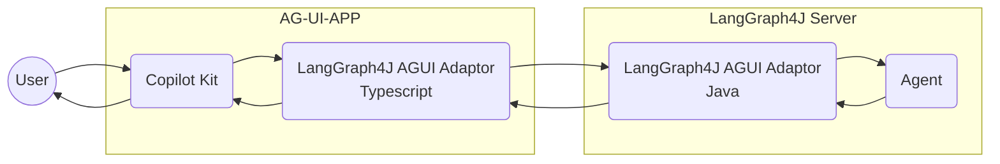
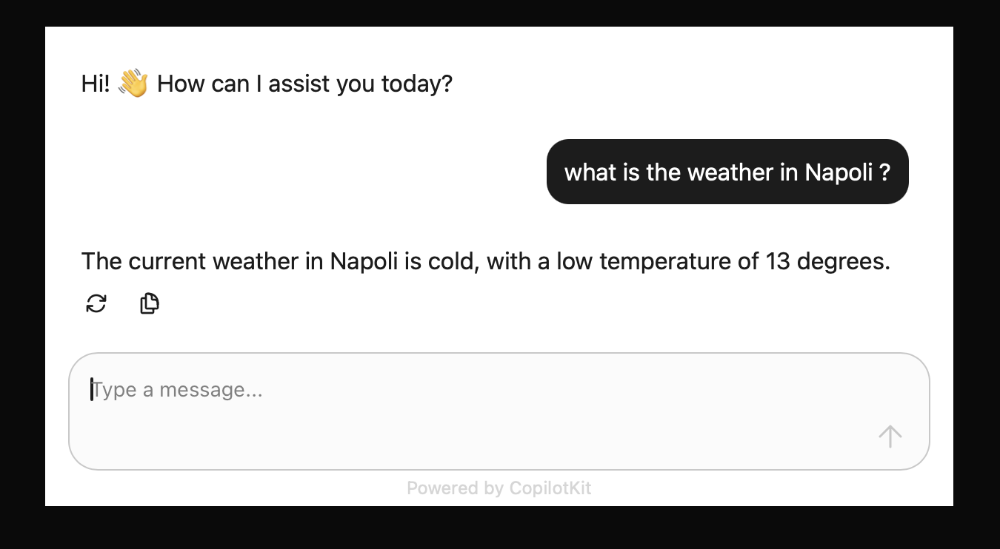

# LangGraph4j support for CopilotKit

Make [LangGraph4j] compliant with [AG-UI protocol][AG-UI] with [CopilotKit] integration

## Architecture


## Getting Started

### start LangGraph4j Agent**

```bash
mvn package spring-boot:test-run
```

### start CopilotKit App**

```bash
cd webui
npm run dev
```

### open app

Open browser on [http://localhost:3000](http://localhost:3000) and play with chat




[AG-UI]: https://docs.ag-ui.com/introduction
[CopilotKit]: https://www.copilotkit.ai
[LangGraph4j]: https://github.com/langgraph4j/langgraph4j
