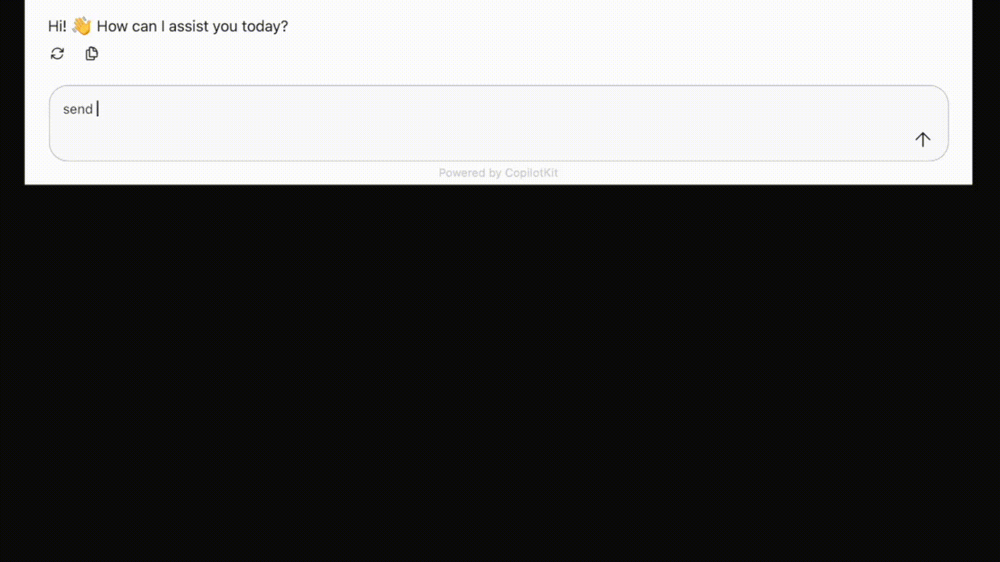

 [][snapshots] [][releases][](https://discord.gg/szVVztSYKh)

# LangGraph4j support for AG-UI (DEPRECATED)

Make [LangGraph4j] compliant with [AG-UI protocol][AG-UI] with [CopilotKit] integration

## Architecture

```mermaid
flowchart LR
    User((User))
    subgraph Browser
        CopilotKitW(Copilot Kit widget)
    end
    CopilotKit(Copilot Kit server)
    LangGraph4JAdaptor(LangGraph4J AGUI Adaptor
    Typescript)
    LangGraph4JServer(LangGraph4J AGUI Adaptor
    Java)
    Agent(Agent)
    subgraph "AG-UI-APP"
        CopilotKit --> LangGraph4JAdaptor
    end
    subgraph "LangGraph4J Server"
        LangGraph4JServer --> Agent
    end
    User --> Browser
    CopilotKitW --> CopilotKit
    CopilotKit --> CopilotKitW
    LangGraph4JAdaptor --> LangGraph4JServer
    %%LangGraph4JServer --> Agent
    Agent --> LangGraph4JServer
    LangGraph4JServer --> LangGraph4JAdaptor
    LangGraph4JAdaptor --> CopilotKit
    Browser --> User
    %% Legend
    %% - The User sends a request to the Copilot Kit.
    %% - The Copilot Kit processes the request and passes it to the LangGraph4J Adaptor.
    %% - The LangGraph4J Adaptor forwards the request to the LangGraph4J Server.
    %% - The LangGraph4J Server processes the request using the Agent.
    %% - The Agent processes the data and sends back a response to the LangGraph4J Server.
    %% - The LangGraph4J Server sends the processed response back to the LangGraph4J Adaptor.
    %% - The LangGraph4J Adaptor then sends the response back to the Copilot Kit.
    %% - Finally, the Copilot Kit presents the results back to the User.

```


## Getting Started

### Start LangGraph4j Agent

```bash
mvn package spring-boot:test-run
```

### Start CopilotKit App

```bash
cd webui
npm run dev
```

### Open web app

Open browser on [http://localhost:3000](http://localhost:3000) and play with chat

### Demo 



## References

* [LangGraph4j Meets AG-UI - Building UI/UX in the AI Agents era](https://bsorrentino.github.io/bsorrentino/ai/2025/08/21/LangGraph4j-meets-AG-UI.html)

[releases]: https://central.sonatype.com/search?q=a%3Alanggraph4j-copilotkit
[snapshots]: https://central.sonatype.com/repository/maven-snapshots/org/bsc/langgraph4j/langgraph4j-copilotkit
[AG-UI]: https://docs.ag-ui.com/introduction
[CopilotKit]: https://www.copilotkit.ai
[LangGraph4j]: https://github.com/langgraph4j/langgraph4j
